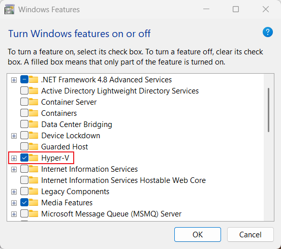
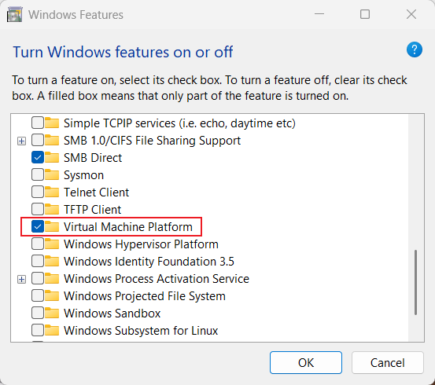

# PSOC™ Edge AI 部署全攻略

## 開發環境設定教學

### Windows Features

開啟**Hyper-V**以及**Virtual Machine Plateform**。開啟後要將電腦重新開機。




### 安裝WSL Image

打開PowerShell輸入以下指令。

```
wsl --update  # 更新wsl

wsl --shutdown  # wsl關機

wsl  # 重開wsl

wsl --install Ubuntu  # 安裝ubuntu
```

創建完帳號將剛剛創立的user加入root。
使用`sudo vim /etc/passwd`編輯使用者，找到剛剛加入的使用者更改user id=0跟group id=0。改完會類似於`user:x:0:0::/home/user:/bin/bash`，改完打`:q`可以退出vim編輯器。之後把user加入sudo群組，`sudo usermod -a -G sudo user`。

```
exit  # 創建帳號後退出wsl

wsl --list --verbose  # 確認安裝狀態
```

### 安裝wsl需要套件

打開PowerShell輸入以下指令。

```
wsl  # 回到wsl

apt install software-properties-common -y  #安裝python相關套件

add-apt-repository ppa:deadsnakes/ppa -y  # 新增repository

sudo apt update && sudo apt upgrade -y  # 更新repository資料庫
```

安裝python

```
sudo apt install -y make build-essential libssl-dev zlib1g-dev libbz2-dev \
libreadline-dev libsqlite3-dev wget curl llvm libncursesw5-dev xz-utils \
tk-dev libxml2-dev libxmlsec1-dev libffi-dev liblzma-dev git  # 安裝套件

curl https://pyenv.run | bash  # 安裝 pyenv
```

將 pyenv 加入環境變數

```
cat << 'EOF' >> ~/.bashrc

# pyenv configuration
export PYENV_ROOT="$HOME/.pyenv"
[[ -d $PYENV_ROOT/bin ]] && export PATH="$PYENV_ROOT/bin:$PATH"
eval "$(pyenv init - bash)"
eval "$(pyenv virtualenv-init -)"
EOF
```

安裝python

```
pyenv install 3.12.3  安裝python

pyenv global 3.12.3  # 設定全域預設使用 3.12.3

python --version
```

### 安裝python虛擬環境

```
python -m venv py
source py/bin/activate
pip install tensorflow-cpu
```

驗證tensorflow是否安裝成功。

```
python -c "
import tensorflow as tf;
print(tf.config.list_physical_devices('CPU'))
"
```

```
pip install numpy pandas matplotlib scikit-learn
```

### ModusToolbox Setup

需要安裝項目

- Base Installation:
  - ModusToolbox Eclipse IDE
  - Arm GNU Toolchain (GCC)
  - ModusToolbox Tools Package

- Addition Packages:
  - AIROC Test and Debug Tool
  - DEEPCRAFT Model Converter
  - DEEPCRAFT Studio
  - ModusToolbox Edge Protect Security Suite
  - ModusToolbox Programming tools
  - DEEPCRAFT Audio Enhancement Tech Pack
  - ModusToolbox CAPSENSE and Multi-Sense Pack
  - ModusToolbox Machine Learning Pack
  - ModusToolbox Motor Suite
