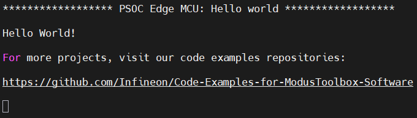
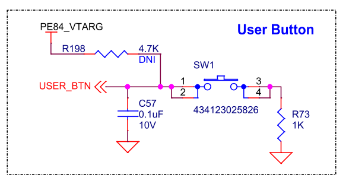
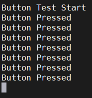
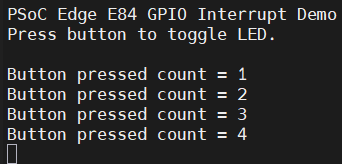
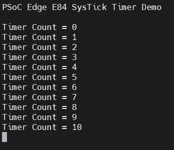

# AI簡介與基礎操作

上課教材

- [Infineon PSOC™ Edge E84 AI Kit-6 hello world 程式說明](https://hackmd.io/@PowenKo/BkYZ8tVlfg)
- [Infineon PSoC™ Edge E84 AI Kit-9 按鈕](https://hackmd.io/@PowenKo/B1vkG5Pxze)
- [Infineon PSoC™ Edge E84 AI Kit-10 Interrupt 中斷](https://hackmd.io/-LeHf3rYQway7EknwpOYPw?view)
- [Infineon PSoC™ Edge E84 AI Kit-11 Timer](https://hackmd.io/TCno2kyORyKt0vG9tucaLg?view)

## 目錄

- [board-details](#board-details)
- [hello-world韌體流程](#hello-world韌體流程)
- [按鈕](#按鈕)
- [中斷](#中斷)
- [SysTick Timer](#systick-timer)

## Board details

- PSOC™ Edge E84 MCU - PSE846GPS2DBZC4A
- AIROC™ CYW55513IUBGT based Wi-Fi & Bluetooth
- MIPI-DSI display interface
- 512-Mbit external Quad-SPI NOR flash
- 128-Mbit PSRAM
- 6-axis accelerometer and gyroscope (BMI270), 3-axis magnetometer (BMM350), XENSIV™ digital barometric pressure sensor with built-in temperature sensor (DPS368), digital humidity and temperature sensor (SHT40) and XENSIV™ 60 GHz RADAR sensor (BGT60TR13C) for data collection
- KitProg3 onboard SWD programmer/debugger, USB-UART, and USB-I2C bridge functionality
- Supports 1.8 V and 3.3 V operation of PSOC™ Edge E84 MCU
- Three user LEDs, a user button, and a reset button for PSOC™ Edge E84 MCU
- One mode selection button and one status LED for KitProg3

## hello world韌體流程

1. 初始化 PSOC Edge 開發板與周邊。
2. 啟用全域中斷。
3. 初始化 retarget-io，讓 printf() 可以透過 Debug UART 輸出。
4. 在終端機印出 Hello World!。
5. 啟動 CM55 核心。
6. 進入無窮迴圈，讓 LED1 每 1 秒反相一次。

```
main()
 ├─ cybsp_init()
 │   └─ 初始化板子與周邊
 │
 ├─ __enable_irq()
 │   └─ 啟用中斷
 │
 ├─ init_retarget_io()
 │   └─ 設定 printf() 輸出到 UART
 │
 ├─ printf()
 │   └─ 顯示 Hello World 訊息
 │
 ├─ Cy_SysEnableCM55()
 │   └─ 啟動 Cortex-M55 核心
 │
 └─ for(;;)
     └─ LED1 閃爍
```

### 標頭檔說明

```
#include "cybsp.h"
#include "retarget_io_init.h"
```

#### cybsp.h

`cybsp` 是 Cypress Board Support Package 的縮寫，也就是開發板支援套件。

它通常提供：

- 開發板初始化函式
- GPIO 腳位定義
- LED、按鈕、UART 等板級資源
- cybsp_init()
- CYBSP_USER_LED1_PORT
- CYBSP_USER_LED1_PIN

#### retarget_io_init.h

這個標頭檔與 UART 輸出有關。

在嵌入式系統中，printf() 預設不一定知道要輸出到哪裡。透過 retarget-io，可以將 printf() 重新導向到 Debug UART。

### 結果

打開MobaXterm可以看UART port看結果。LED會閃爍，並且console會跳出以下畫面。



### Hello World全部程式碼

```
/*******************************************************************************
* File Name        : main.c
*
* Description      : This source file contains the main routine for non-secure
*                    application in the CM33 CPU
*
* Related Document : See README.md
*/

/*******************************************************************************
* Header Files
*******************************************************************************/

#include "cybsp.h"
#include "retarget_io_init.h"

/*******************************************************************************
* Macros
*******************************************************************************/
#define BLINKY_LED_DELAY_MSEC       (1000U)

/* The timeout value in microseconds used to wait for CM55 core to be booted */
#define CM55_BOOT_WAIT_TIME_USEC    (10U)

/* App boot address for CM55 project */
#define CM55_APP_BOOT_ADDR          (CYMEM_CM33_0_m55_nvm_START + \
                                        CYBSP_MCUBOOT_HEADER_SIZE)

/*******************************************************************************
* Function Name: main
*******************************************************************************/
int main(void)
{
    cy_rslt_t result = CY_RSLT_SUCCESS;  // PDL / HAL 常用的回傳結果型別

    /* Initialize the device and board peripherals. */
    result = cybsp_init();

    /* Board initialization failed. Stop program execution. */
    if (CY_RSLT_SUCCESS != result)
    {
        handle_app_error();
    }

    /* Enable global interrupts */
    __enable_irq();

    /* Initialize retarget-io middleware */
    init_retarget_io();

    /* \x1b[2J\x1b[;H - ANSI ESC sequence for clear screen. */
    printf("\x1b[2J\x1b[;H");

    printf("****************** "
           "PSOC Edge MCU: Hello world "
           "****************** \r\n\n");

    printf("Hello World!\r\n\n");
    printf("For more projects, "
           "visit our code examples repositories:\r\n\n");

    printf("https://github.com/Infineon/"
           "Code-Examples-for-ModusToolbox-Software\r\n\n");

    /* Enable CM55. */
    /* CM55_APP_BOOT_ADDR must be updated if CM55 memory layout is changed.*/
    Cy_SysEnableCM55(MXCM55, CM55_APP_BOOT_ADDR, CM55_BOOT_WAIT_TIME_USEC);

    for(;;)
    {
        Cy_GPIO_Inv(CYBSP_USER_LED1_PORT, CYBSP_USER_LED1_PIN);
        Cy_SysLib_Delay(BLINKY_LED_DELAY_MSEC);
    }
}

/* [] END OF FILE */
```

## 按鈕

按鈕使用SW1。使用的是E84 MCU的pin `P7[0]` 。電路圖如下，按下去時USER_BTN會變成GND。



### 韌體講解

我們會使用GPIO去讀取BTN現在的值，所以要先設定一個變數連到板子的`P7[0]`。

```
uint32_t button_state = Cy_GPIO_Read(CYBSP_USER_BTN_PORT, CYBSP_USER_BTN_PIN);
```

按下ctrl+滑鼠左鍵可以查看`CYBSP_USER_BTN_PORT`、`CYBSP_USER_BTN_PIN`兩個變數的定義。可以看到我們這邊是設定成`port 7 pin 0`，也就是`p7[0]`。這樣子`button_state`就會是按鈕的USER_BTN數值。

```
#define CYBSP_SW1_PORT GPIO_PRT7
#define CYBSP_USER_BTN_PORT CYBSP_SW1_PORT

#define CYBSP_USER_BTN_PIN CYBSP_SW1_PIN
#define CYBSP_SW1_PIN 0U
```

### 結果

打開MobaXterm可以看UART port看結果。按下按鈕燈會暗，並且console會跳出以下畫面。



### 按鈕全部程式碼

```
/*******************************************************************************
* File Name        : main.c
*
* Description      : This source file contains the main routine for non-secure
*                    application in the CM33 CPU
*
* Related Document : See README.md
*/

/*******************************************************************************
* Header Files
*******************************************************************************/

#include "cybsp.h"
#include "retarget_io_init.h"

/*******************************************************************************
* Macros
*******************************************************************************/
#define BLINKY_LED_DELAY_MSEC       (100U)


/*******************************************************************************
* Main
*******************************************************************************/

int main(void)
{
    cy_rslt_t result;   /* 儲存函式執行結果 */

    /* 初始化開發板硬體資源 */
    result = cybsp_init();

    /* 若初始化失敗，進入錯誤處理 */
    if (result != CY_RSLT_SUCCESS)
    {
        handle_app_error();
    }

    /* 啟用全域中斷 */
    __enable_irq();

    /* 初始化 UART，讓 printf 可以輸出到終端機 */
    init_retarget_io();

    /* 印出啟動訊息 */
	printf("\x1b[2J\x1b[;H");
    printf("Button Test Start\r\n");

    /* 主迴圈 */
    for (;;)
    {
        /* 讀取按鈕狀態 */
        uint32_t button_state = Cy_GPIO_Read(CYBSP_USER_BTN_PORT, CYBSP_USER_BTN_PIN);

        /*
         * 多數 PSoC 開發板的按鈕是 Active Low
         * 也就是：
         * 0 = 按下
         * 1 = 放開
         */
        if (button_state == 0)
        {
            /* 按鈕被按下，暗 LED */
            Cy_GPIO_Write(CYBSP_USER_LED1_PORT, CYBSP_USER_LED1_PIN, 0);

            printf("Button Pressed\r\n");
        }
        else
        {
            /* 按鈕放開，亮 LED */
            Cy_GPIO_Write(CYBSP_USER_LED1_PORT, CYBSP_USER_LED1_PIN, 1);
        }

        /* 簡單延遲，避免 printf 太頻繁 */
        Cy_SysLib_Delay(BLINKY_LED_DELAY_MSEC);
    }
}
```

## 中斷

以兩種方式，HAL以及PDL。HAL需要header file `cyhal.h`，屬於比較高級的中斷方式，使用callback來進行中斷。PDL則是一步一步自己建立專屬於這個MCU的中斷程式。

### 整體中斷流程

```
[按鈕按下]
  ↓ P7.0：1 → 0
邊緣偵測 (是設定的邊緣嗎？(Falling))
  ↓
遮罩 (這支腳允許發中斷嗎？(Mask = 1))
  ↓
NVIC (這個中斷有啟用嗎？優先級夠高嗎？)
  ↓ 是 → 打斷 CPU
向量表 (查表：Port 7 中斷 → btn_isr())
  ↓
執行 ISR (清旗標、做事)
  ↓
返回
```

#### 中斷設定

有以下幾個東西需要設定

- [中斷來源與優先權](#中斷來源與優先權)
- [中斷觸發條件](#中斷觸發條件)
- [中斷遮罩](#中斷遮罩)
- [NVIC 中斷設定](#nvic-中斷設定)
- [註冊中斷處理函式](#註冊中斷處理函式)
- [啟用全域中斷]()

##### 中斷來源與優先權

```
const cy_stc_sysint_t button_irq_cfg =
{
    .intrSrc = CYBSP_USER_BTN_IRQ,
    .intrPriority = 3
};
```

cy_stc_sysint_t 用來設定系統中斷。

| 欄位         | 說明                       |
| ------------ | -------------------------- |
| intrSrc      | 中斷port來源               |
| intrPriority | 中斷優先權，越小優先權越高 |

##### 中斷觸發條件

```
Cy_GPIO_SetInterruptEdge(CYBSP_USER_BTN_PORT,
                         CYBSP_USER_BTN_PIN,
                         CY_GPIO_INTR_FALLING);
```

有以下幾種觸發條件

| 設定                 | 何時觸發 |
| -------------------- | -------- |
| CY_GPIO_INTR_RISING  | 0 → 1    |
| CY_GPIO_INTR_FALLING | 1 → 0    |
| CY_GPIO_INTR_BOTH    | 兩種都算 |
| CY_GPIO_INTR_DISABLE | 都不算   |

##### 中斷遮罩

```
Cy_GPIO_SetInterruptMask(CYBSP_USER_BTN_PORT,
                         CYBSP_USER_BTN_PIN,
                         1UL);
```

將`P7[0]`，也就是BTN按鈕的中斷遮罩打開，允許這支腳的事件發出中斷。

##### NVIC 中斷設定

```
NVIC_EnableIRQ(button_irq_cfg.intrSrc);
```

CPU 端的中斷總管，是 ARM Cortex‑M 核心內建的中斷控制器。系統裡有幾百個中斷來源（GPIO、UART、Timer、DMA…），全部匯集到 NVIC，由它決定：

- 要不要理這個中斷：NVIC_EnableIRQ() / NVIC_DisableIRQ()
- 優先順序：多個中斷同時來，誰先處理；高優先級的還能打斷正在處理的低優先級中斷，這就是名稱裡 "Nested"（巢狀）的意思。
- 清除待處理狀態：NVIC_ClearPendingIRQ()，避免一開啟就先跑一次舊的殘留中斷。

##### 註冊中斷處理函式

在main之前先自行定義中斷後要做什麼事情。

```
/* 按鈕 GPIO 中斷處理函式 */
void button_isr(void)
{
    /* 確認是否為使用者按鈕觸發中斷 */
    if (Cy_GPIO_GetInterruptStatusMasked(CYBSP_USER_BTN_PORT,
                                         CYBSP_USER_BTN_PIN) != 0)
    {
        /* 清除 GPIO 中斷旗標 */
        Cy_GPIO_ClearInterrupt(CYBSP_USER_BTN_PORT,
                               CYBSP_USER_BTN_PIN);

        /* 通知主迴圈處理按鈕事件 */
        button_flag = true;
    }
}
```

將處理函式登記進中斷向量表。告訴硬體「之後 Port 7 中斷來了，就跑這個函式。

```
Cy_SysInt_Init(&button_irq_cfg, button_isr);
```

##### 啟用全域中斷

```
__enable_irq();
```

此函式會啟用 CPU 全域中斷。因此要放到中斷設定的最後面。

### 結果

打開MobaXterm可以看UART port看結果。每按一下BTN (SW1)，LED都會反轉，並且console會跳出以下畫面。



### 中斷全部程式碼

```
#include "cybsp.h"
#include "retarget_io_init.h"

/* 按鈕中斷旗標 */
volatile bool button_flag = false;

/* 按鈕按下次數 */
uint32_t button_count = 0;

/* 按鈕 GPIO 中斷處理函式 */
void button_isr(void)
{
    /* 確認是否為使用者按鈕觸發中斷 */
    if (Cy_GPIO_GetInterruptStatusMasked(CYBSP_USER_BTN_PORT,
                                         CYBSP_USER_BTN_PIN) != 0)
    {
        /* 清除 GPIO 中斷旗標 */
        Cy_GPIO_ClearInterrupt(CYBSP_USER_BTN_PORT,
                               CYBSP_USER_BTN_PIN);

        /* 通知主迴圈處理按鈕事件 */
        button_flag = true;
    }
}

int main(void)
{
    cy_rslt_t result;

    /* GPIO 中斷設定 */
    const cy_stc_sysint_t button_irq_cfg =
    {
        .intrSrc = CYBSP_USER_BTN_IRQ,
        .intrPriority = 3
    };

    /* 初始化開發板 */
    result = cybsp_init();

    if (result != CY_RSLT_SUCCESS)
    {
        handle_app_error();
    }

    /* 初始化 UART printf */
    init_retarget_io();

    printf("\x1b[2J\x1b[;H");
    printf("PSoC Edge E84 GPIO Interrupt Demo\r\n");
    printf("Press button to toggle LED.\r\n\n");

    /*
     * 設定按鈕中斷觸發方式
     *
     * 多數開發板按鈕為 Active Low：
     * 放開 = 1
     * 按下 = 0
     *
     * 因此按下時會產生下降緣，所以使用 CY_GPIO_INTR_FALLING。
     */
    Cy_GPIO_SetInterruptEdge(CYBSP_USER_BTN_PORT,
                             CYBSP_USER_BTN_PIN,
                             CY_GPIO_INTR_FALLING);

    /* 啟用該 GPIO 腳位的中斷遮罩 */
    Cy_GPIO_SetInterruptMask(CYBSP_USER_BTN_PORT,
                             CYBSP_USER_BTN_PIN,
                             1UL);

    /* 註冊 GPIO 中斷處理函式 */
    Cy_SysInt_Init(&button_irq_cfg, button_isr);

    /* 啟用 NVIC 中斷 */
    NVIC_EnableIRQ(button_irq_cfg.intrSrc);

    /* 啟用全域中斷 */
    __enable_irq();

    for (;;)
    {
        if (button_flag)
        {
            /* 清除旗標 */
            button_flag = false;

            /* 簡單去彈跳 */
            Cy_SysLib_Delay(50);

            /* 確認按鈕仍然是按下狀態 */
            if (Cy_GPIO_Read(CYBSP_USER_BTN_PORT,
                             CYBSP_USER_BTN_PIN) == 0)
            {
                /* LED 反轉 */
                Cy_GPIO_Inv(CYBSP_USER_LED1_PORT,
                            CYBSP_USER_LED1_PIN);

                /* 按鈕次數加 1 */
                button_count++;

                /* 印出按鈕次數 */
                printf("Button pressed count = %lu\r\n", button_count);
            }
        }
    }
}
```

## SysTick Timer

Arm Cortex-M 內建的 SysTick Timer，不需要額外設定其他計時器模組，即可快速建立週期性中斷。

### 中斷設定

SysTick_Handler屬於核心內建中斷函數，也就是不用再額外註冊就已經在中斷向量表了。可以跳過登記的步驟。同時可以直接在main.c編寫這個函數來複寫系統預設的內建函數。

此外我們需要設定多少個clk會進入SysTick Timer中斷。下面的例子假設MCU是400MHz，也就是每毫秒跑400k個clk。所以每1毫秒都會進中斷一次。

```
if (SysTick_Config(SystemCoreClock / 1000U) != 0)
    {
        handle_app_error();
    }
```

### 結果

打開MobaXterm可以看UART port看結果。每隔1秒燈會反向，並且console會跳出以下畫面。



### 完整程式碼

```
#include "cybsp.h"
#include "retarget_io_init.h"

/* 1 秒旗標 */
volatile bool timer_flag = false;

/* 毫秒計數器 */
volatile uint32_t ms_count = 0;

/* 秒數計數器 */
uint32_t count = 0;

/*
 * SysTick 中斷函式
 * 每 1 ms 會進入一次
 */
void SysTick_Handler(void)
{
    /* 毫秒計數加 1 */
    ms_count++;

    /* 累積 1000 ms = 1 秒 */
    if (ms_count >= 1000)
    {
        /* 清除毫秒計數 */
        ms_count = 0;

        /* 設定 1 秒旗標，通知主迴圈 */
        timer_flag = true;
    }
}

int main(void)
{
    cy_rslt_t result;

    /* 初始化開發板 */
    result = cybsp_init();

    /* 若初始化失敗，進入錯誤處理 */
    if (result != CY_RSLT_SUCCESS)
    {
        handle_app_error();
    }

    /* 初始化 UART printf */
    init_retarget_io();

    /* 清除終端機畫面 */
    printf("\x1b[2J\x1b[;H");

    /* 顯示啟動訊息 */
    printf("PSoC Edge E84 SysTick Timer Demo\r\n\r\n");

    /*
     * 設定 SysTick 每 1 ms 觸發一次
     *
     * SystemCoreClock 代表 CPU 時脈頻率
     * SystemCoreClock / 1000U 代表 1 ms
     */
    if (SysTick_Config(SystemCoreClock / 1000U) != 0)
    {
        handle_app_error();
    }

    /* 啟用全域中斷 */
    __enable_irq();

    /* 主迴圈 */
    for (;;)
    {
        if (timer_flag)
        {
            /* 清除 1 秒旗標 */
            timer_flag = false;

            /* LED 反轉 */
            Cy_GPIO_Inv(CYBSP_USER_LED1_PORT,
                        CYBSP_USER_LED1_PIN);

            /* 印出計數 */
            printf("Timer Count = %lu\r\n", count);

            /* 秒數計數加 1 */
            count++;
        }
    }
}

```
