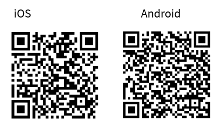
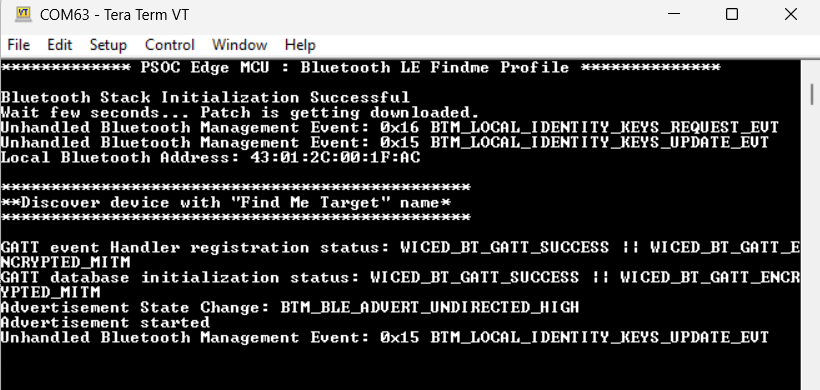
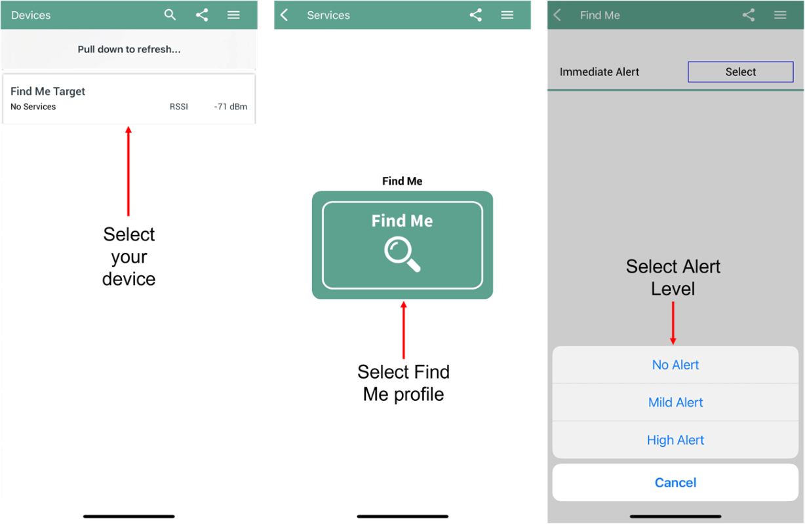
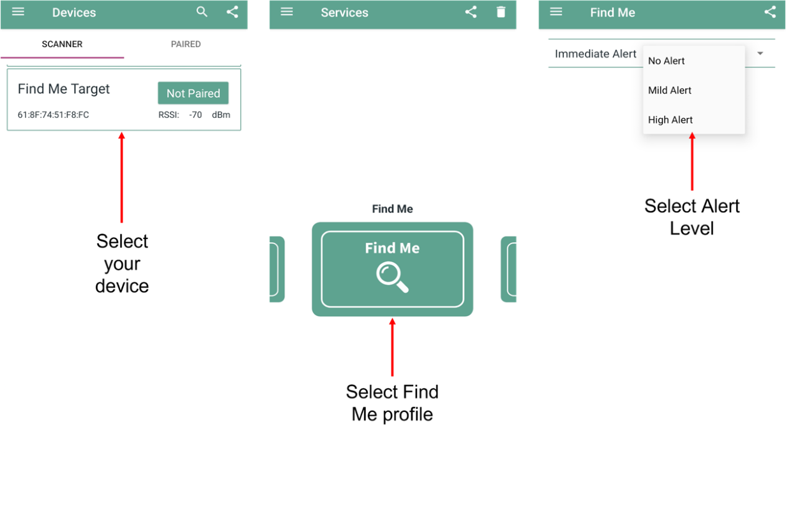
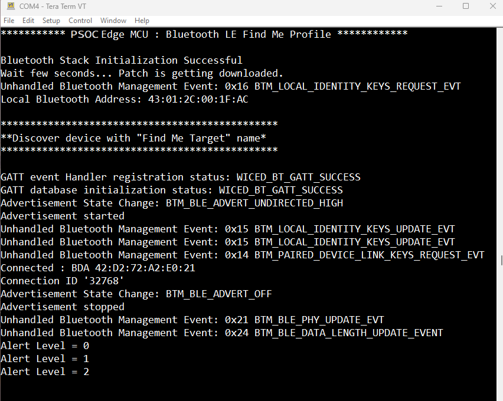

# PSOC&trade; Edge MCU: Bluetooth&reg; LE Find Me Profile

The code example demonstrates the implementation of a simple Bluetooth&reg; Immediate Alert Service (IAS)-based Find Me Profile (FMP) using the Infineon PSOC&trade; Edge MCU with AIROC&trade; CYW55513 Wi-Fi & Bluetooth&reg; combo chip and ModusToolbox&trade; software environment.

This code example has a three project structure: CM33 secure, CM33 non-secure, and CM55 projects. All three projects are programmed to the external QSPI flash and executed in Execute in Place (XIP) mode. Extended boot launches the CM33 secure project from a fixed location in the external flash, which then configures the protection settings and launches the CM33 non-secure application. Additionally, CM33 non-secure application enables CM55 CPU and launches the CM55 application.
> **Note:** KIT_PSE84_HMI programs all three projects to the external OSPI flash (instead of QSPI).

[View this README on GitHub.](https://github.com/Infineon/mtb-example-psoc-edge-btstack-findme)

[Provide feedback on this code example.](https://yourvoice.infineon.com/jfe/form/SV_1NTns53sK2yiljn?Q_EED=eyJVbmlxdWUgRG9jIElkIjoiQ0UyMzkxODAiLCJTcGVjIE51bWJlciI6IjAwMi0zOTE4MCIsIkRvYyBUaXRsZSI6IlBTT0MmdHJhZGU7IEVkZ2UgTUNVOiBCbHVldG9vdGgmcmVnOyBMRSBGaW5kIE1lIFByb2ZpbGUiLCJyaWQiOiJhcnZpbmRrdW1hci5zdXJlc2hrdW1hckBpbmZpbmVvbi5jb20iLCJEb2MgdmVyc2lvbiI6IjIuMy4xIiwiRG9jIExhbmd1YWdlIjoiRW5nbGlzaCIsIkRvYyBEaXZpc2lvbiI6Ik1DRCIsIkRvYyBCVSI6IklDVyIsIkRvYyBGYW1pbHkiOiJQU09DIn0=)

See the [Design and implementation](docs/design_and_implementation.md) for the functional description of this code example.

## Requirements

- [ModusToolbox&trade;](https://www.infineon.com/modustoolbox) v3.7 or later (tested with v3.8)
- Board support package (BSP) minimum required version: 1.0.0
- Programming language: C
- Associated parts: All [PSOC&trade; Edge MCU](https://www.infineon.com/products/microcontroller/32-bit-psoc-arm-cortex/32-bit-psoc-edge-arm) parts

## Supported toolchains (make variable 'TOOLCHAIN')

- GNU Arm&reg; Embedded Compiler v14.2.1 (`GCC_ARM`) – Default value of `TOOLCHAIN`
- Arm&reg; Compiler v6.22 (`ARM`)
- IAR C/C++ Compiler v9.50.2 (`IAR`)
- LLVM Embedded Toolchain for Arm&reg; v19.1.5 (`LLVM_ARM`)

## Supported kits (make variable 'TARGET')

- [PSOC&trade; Edge E84 Evaluation Kit](https://www.infineon.com/KIT_PSE84_EVAL) (`KIT_PSE84_EVAL_EPC2`) – Default value of `TARGET`
- [PSOC&trade; Edge E84 Evaluation Kit](https://www.infineon.com/KIT_PSE84_EVAL) (`KIT_PSE84_EVAL_EPC4`)
- [PSOC&trade; Edge E84 AI Kit](https://www.infineon.com/KIT_PSE84_AI) (`KIT_PSE84_AI`)
- [PSOC&trade; Edge E84 HMI Kit](https://www.infineon.com/KIT_PSE84_HMI) (`KIT_PSE84_HMI`)

## Hardware setup

This example uses the board's default configuration. See the kit user guide to ensure that the board is configured correctly.

Ensure the following jumper and pin configuration on board.
- BOOT SW must be in the HIGH/ON position
- J20 and J21 must be in the tristate/not connected (NC) position for the PSOC™ Edge E84 Evaluation Kit

> **Note:** This hardware setup is not required for KIT_PSE84_AI.

## Software setup

See the [ModusToolbox&trade; tools package installation guide](https://www.infineon.com/ModusToolboxInstallguide) for information about installing and configuring the tools package.

Install a terminal emulator if you do not have one. Instructions in this document use [Tera Term](https://teratermproject.github.io/index-en.html).

This code example consists of two parts: a locator and a target.

For the locator, download and install the AIROC&trade; Bluetooth&reg; Connect App on your [Android](https://play.google.com/store/apps/details?id=com.infineon.airocbluetoothconnect) or [iOS](https://apps.apple.com/in/app/airoc-bluetooth-connect-app/id6443702288) phone.

Scan the following QR codes from your mobile phone to download the AIROC&trade; Bluetooth&reg; Connect App.

You can also use other Android or iOS apps that support the IAS service.

This example requires no additional software or tools.

## Operation

See [Using the code example](docs/using_the_code_example.md) for instructions on creating a project, opening it in various supported IDEs, and performing tasks, such as building, programming, and debugging the application within the respective IDEs.

**Note**: The idle power mode configuration in the device configurator is set to CPU Sleep to enable LED blinking, which is controlled by PWMs. You can change the idle power mode to Deep Sleep to allow the device to enter Deep Sleep mode; however, this may affect PWM functionality.

1. Connect the board to your PC using the provided USB cable through the KitProg3 USB connector

2. Open a terminal program and select the KitProg3 COM port. Set the serial port parameters to 8N1 and 115200 baud

3. After programming, the application starts automatically and initializes Bluetooth&reg; stack and application as shown in **Figure 1**

   **Figure 1. Log messages on KitProg3 COM port**

   

4. To test using the AIROC&trade; Bluetooth&reg; Connect App, do the following (see the equivalent AIROC&trade; Bluetooth&reg; Connect App screenshots in **Figure 2** and **Figure 3**):

   1. Turn ON Bluetooth&reg; and Location on your Android or iOS device

   2. Launch the AIROC&trade; Bluetooth&reg; Connect App

   3. USER_LED2 starts blinking to indicate that advertising has started. Advertising will stop after 120 seconds if a connection has not been established and USER_LED2 will turn off

   4. Swipe down on the AIROC&trade; Bluetooth&reg; Connect App home screen to start scanning for Bluetooth&reg; LE peripheral devices. Your device named “Find Me Target” displays in the AIROC&trade; Bluetooth&reg; Connect App home screen. Select your device to establish a Bluetooth&reg; LE connection. Once the connection is established, USER_LED2 changes from blinking state to always ON state

   5. Select the 'Find Me Profile' from the carousel view

   6. Select an *Alert Level* value on the **Find Me Profile** screen. Observe the state of USER_LED1 on the device; it changes based on the alert level

      **Table 1. User LED1 State based on Alert Level**

      Alert Level | USER_LED1 State
      --------|------------------------
      No Alert    | LED OFF
      Mild Alert | LED BLINK
      High Alert | LED ON

    > **Note:** The KIT_PSE84_HMI features a single RGB LED to display both Bluetooth&reg; connection status and alert level selected on the Find Me Profile screen instead of separate LEDs. You will notice an overlapping LED color in some status.

       

      **Figure 2. Testing with the AIROC&trade; Bluetooth&reg; Connect App on iOS**

      

       

      **Figure 3. Testing with the AIROC&trade; Bluetooth&reg; Connect App on Android**

      

5. Observe the messages on the UART terminal based on the Alert Level selected as shown in **Figure 4** 

   **Figure 4. Log messages on KitProg3 COM port**

   

### Resources and settings

This section explains the ModusToolbox&trade; software resources and their configurations as used in this code example. Note that all the configuration explained in this section has already been implemented in the code example.

- **Bluetooth&reg; Configurator:** The Bluetooth&reg; peripheral has a configurator called the “Bluetooth&reg; Configurator” that is used to generate the Bluetooth&reg; LE GATT database and various Bluetooth&reg; settings for the application. These settings are stored in the file named *design.cybt*.

See the [Bluetooth&reg; Configurator guide](https://www.infineon.com/ModusToolboxBLEConfig) for more details.

## Related resources

Resources  | Links
-----------|----------------------------------
Application notes  | [AN235935](https://www.infineon.com/AN235935) – Getting started with PSOC&trade; Edge E8 MCU on ModusToolbox&trade; software   [AN236697](https://www.infineon.com/AN236697) – Getting started with PSOC&trade; MCU and AIROC&trade; Connectivity devices
Code examples  | [Using ModusToolbox&trade;](https://github.com/Infineon/Code-Examples-for-ModusToolbox-Software) on GitHub
Device documentation | [PSOC&trade; Edge MCU datasheets](https://www.infineon.com/products/microcontroller/32-bit-psoc-arm-cortex/32-bit-psoc-edge-arm#documents)   [PSOC&trade; Edge MCU reference manuals](https://www.infineon.com/products/microcontroller/32-bit-psoc-arm-cortex/32-bit-psoc-edge-arm#documents)
Development kits | Select your kits from the [Evaluation board finder](https://www.infineon.com/cms/en/design-support/finder-selection-tools/product-finder/evaluation-board)
Libraries  | [mtb-dsl-pse8xxgp](https://github.com/Infineon/mtb-dsl-pse8xxgp) – Device support library for PSE8XXGP   [retarget-io](https://github.com/Infineon/retarget-io) – Utility library to retarget STDIO messages to a UART port   [btstack-integration](https://github.com/Infineon/btstack-integration) – The btstack-integration hosts platform adaptation layer (porting layer) between AIROC&trade; BTSTACK and Infineon's different hardware platforms
Tools  | [ModusToolbox&trade;](https://www.infineon.com/modustoolbox) – ModusToolbox&trade; software is a collection of easy-to-use libraries and tools enabling rapid development with Infineon MCUs for applications ranging from wireless and cloud-connected systems, edge AI/ML, embedded sense and control, to wired USB connectivity using PSOC&trade; Industrial/IoT MCUs, AIROC&trade; Wi-Fi and Bluetooth&reg; connectivity devices, XMC&trade; Industrial MCUs, and EZ-USB&trade;/EZ-PD&trade; wired connectivity controllers. ModusToolbox&trade; incorporates a comprehensive set of BSPs, HAL, libraries, configuration tools, and provides support for industry-standard IDEs to fast-track your embedded application development

 

## Other resources

Infineon provides a wealth of data at [www.infineon.com](https://www.infineon.com) to help you select the right device, and quickly and effectively integrate it into your design.

## Document history

Document title: *CE239180* – *PSOC&trade; Edge MCU: Bluetooth&reg; LE Find Me Profile*

 Version | Description of change
 ------- | ---------------------
 1.x.0   | New code example   Early access release
 2.0.0   | GitHub release
 2.1.0   | Added KIT_PSE84_AI BSP support
 2.2.0   | Updated design files to fix ModusToolbox&trade; v3.7 build warnings
 2.3.0   | Added KIT_PSE84_HMI BSP support
 2.3.1   | ECO configurations update for KIT_PSE84_HMI
 

All referenced product or service names and trademarks are the property of their respective owners.

The Bluetooth&reg; word mark and logos are registered trademarks owned by Bluetooth SIG, Inc., and any use of such marks by Infineon is under license.

PSOC&trade;, formerly known as PSoC&trade;, is a trademark of Infineon Technologies. Any references to PSoC&trade; in this document or others shall be deemed to refer to PSOC&trade;.

---------------------------------------------------------

(c) 2023-2026, Infineon Technologies AG, or an affiliate of Infineon Technologies AG. All rights reserved.
This software, associated documentation and materials ("Software") is owned by Infineon Technologies AG or one of its affiliates ("Infineon") and is protected by and subject to worldwide patent protection, worldwide copyright laws, and international treaty provisions. Therefore, you may use this Software only as provided in the license agreement accompanying the software package from which you obtained this Software. If no license agreement applies, then any use, reproduction, modification, translation, or compilation of this Software is prohibited without the express written permission of Infineon.
 
Disclaimer: UNLESS OTHERWISE EXPRESSLY AGREED WITH INFINEON, THIS SOFTWARE IS PROVIDED AS-IS, WITH NO WARRANTY OF ANY KIND, EXPRESS OR IMPLIED, INCLUDING, BUT NOT LIMITED TO, ALL WARRANTIES OF NON-INFRINGEMENT OF THIRD-PARTY RIGHTS AND IMPLIED WARRANTIES SUCH AS WARRANTIES OF FITNESS FOR A SPECIFIC USE/PURPOSE OR MERCHANTABILITY. Infineon reserves the right to make changes to the Software without notice. You are responsible for properly designing, programming, and testing the functionality and safety of your intended application of the Software, as well as complying with any legal requirements related to its use. Infineon does not guarantee that the Software will be free from intrusion, data theft or loss, or other breaches (“Security Breaches”), and Infineon shall have no liability arising out of any Security Breaches. Unless otherwise explicitly approved by Infineon, the Software may not be used in any application where a failure of the Product or any consequences of the use thereof can reasonably be expected to result in personal injury.
